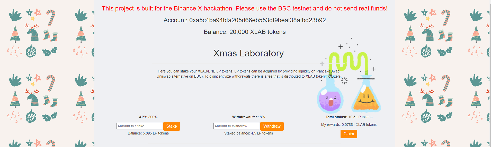
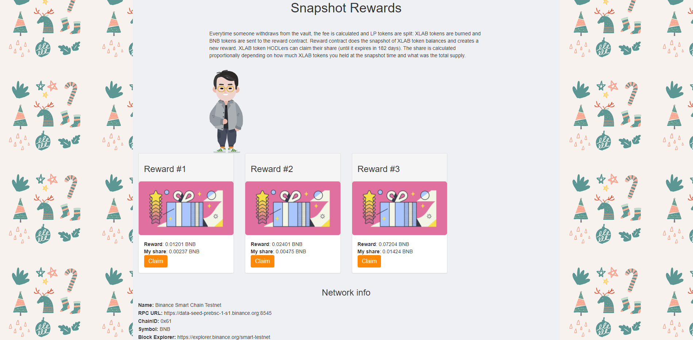

# Xmas Lab

### The DApp is deployed on the  BSC testnet.

The application consists of 2 main parts: the laboratory and reward snapshots.

In the laboratory, you stake XLAB/BNB LP tokens and as a reward get XLAB tokens.
When your tokens are staked, you are accumulating rewards. If you decide to withdraw, you have to pay a withdrawal fee.
 
Withdrawal fees go to the reward contract. XLAB and BNB tokens are extracted from the LP pair. 
XLAB tokens are burned and BNB tokens are stored as a reward. 
Reward contract does the snapshot of XLAB token balances and creates a new reward. 
Then, XLAB token HODLers can claim their share in proportion to how much XLABs they held at the snapshot time and what was the total supply.

This model is expected to benefit both HODLers and liquidity providers.

---

* [Binance X Hackathon on Gitcoin](https://gitcoin.co/issue/binancex/Grant-projects/8/100024334 "Link to the hackaton")

* [Video presentation](https://www.youtube.com/ "Link to a video presentation")

* [Deployed DApp](https://xmas-lab.netlify.app/ "Link to the DApp")

---

### Contracts

* 	Token: [0x4424FA528Ab1e5BCe2372Baf024A5658FEdacBDc](https://explorer.binance.org/smart-testnet/address/0x4424FA528Ab1e5BCe2372Baf024A5658FEdacBDc "Link to the token contract")
* 	Vault: [0x42CFFf119c6033B19ae40DcfF0a4Ed673b292778](https://explorer.binance.org/smart-testnet/address/0x42CFFf119c6033B19ae40DcfF0a4Ed673b292778 "Link to the vault contract")
* 	Reward: [0x41cFEfFB9c00F8313bDF8835f8b478D746e786D0](https://explorer.binance.org/smart-testnet/address/0x41cFEfFB9c00F8313bDF8835f8b478D746e786D0 "Link to the reward contract")

---

### Screenshots

